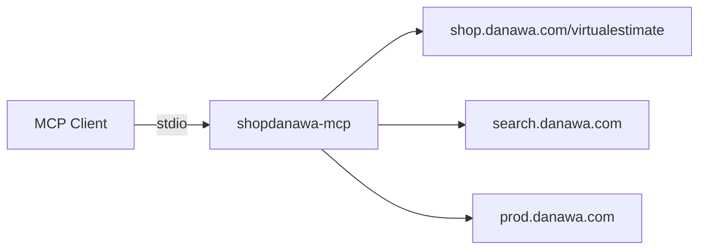

<p align="center">
  
</p>

<p align="center">
  <b>샵다나와 PC 부품 검색 · 상세 · 가격 이력</b><br/>
  <sub>Dynamically search Danawa parts in your MCP clients</sub>
</p>

<p align="center">
  <a href="https://github.com/iamkw0n/shopdanawa-mcp/stargazers"></a>
  <a href="https://github.com/iamkw0n/shopdanawa-mcp/network/members"></a>
  <a href="https://github.com/iamkw0n/shopdanawa-mcp/issues"></a>
  <a href="./LICENSE"></a>
</p>

<p align="center">
  <a href="https://modelcontextprotocol.io"></a>
  <a href="https://nodejs.org"></a>
  <a href="https://www.typescriptlang.org"></a>
  <a href="https://shop.danawa.com"></a>
</p>

<p align="center">
  <a href="#-quick-start">Quick Start</a>
  ·
  <a href="#-tools">Tools</a>
  ·
  <a href="#-client-setup">Client Setup</a>
  ·
  <a href="#-examples">Examples</a>
  ·
  <a href="#-faq">FAQ</a>
  ·
  <a href="https://github.com/iamkw0n/shopdanawa-mcp/issues/new">Report Bug</a>
</p>

---

<details>
<summary><b>📑 Table of contents (Click to show)</b></summary>

- [Important Notices](#-important-notices)
- [Features](#-features)
- [Quick Start](#-quick-start)
- [Tools](#-tools)
- [One-Click Install Prompt](#-one-click-install-prompt)
- [Client Setup](#-client-setup)
  - [Cursor](#cursor)
  - [Claude Code](#claude-code)
  - [Claude Desktop](#claude-desktop)
  - [OpenAI Codex](#openai-codex)
  - [ChatGPT](#chatgpt)
- [Examples](#-examples)
- [How It Works](#-how-it-works)
- [FAQ](#-faq)
- [License](#-license)

</details>

---

## ⚠️ Important Notices

> [!IMPORTANT]
> 이 프로젝트는 **다나와 공식 Open API가 아닌** 공개 웹 페이지를 스크래핑합니다. 사이트 구조가 바뀌면 일부 기능이 깨질 수 있습니다. **개인·비상업적 용도**를 권장합니다.

> [!WARNING]
> 과도한 요청은 다나와에서 차단될 수 있습니다. 차단이 잦으면 `ZYTE_API_KEY` 환경 변수로 Zyte 프록시를 켤 수 있습니다.

---

## ✨ Features

| | |
| :--- | :--- |
| 🔍 **부품 검색** | 키워드·카테고리 기반 샵다나와 검색 |
| 💰 **가격 비교** | 판매처별 최저가·가격 이력 조회 |
| 🔌 **stdio MCP** | Cursor, Claude, Codex 등 로컬 클라이언트 지원 |
| 📦 **Zero build** | `npm install` 후 `npm start`로 즉시 실행 |

---

## 🚀 Quick Start

```bash
git clone https://github.com/iamkw0n/shopdanawa-mcp.git
cd shopdanawa-mcp
npm install
npm start
```

공통 실행 명령:

```bash
npx tsx src/index.ts
```

---

## 🛠 Tools

| Tool | Description |
| :--- | :--- |
| `search_parts` | 키워드 부품 검색 |
| `list_by_category` | 카테고리별 목록 (CPU, GPU, RAM …) |
| `get_product_detail` | 상품 상세 · 판매처 가격 |
| `get_price_history` | 가격 이력 |

---

## 💬 One-Click Install Prompt

Cursor / Claude Code / Codex에서 아래 프롬프트를 붙여넣으면 MCP 설치를 요청할 수 있습니다.

```
Github에서 iamkw0n/shopdanawa-mcp 를 가져와서 MCP 서버 설치를 해줘.
```

---

## 🔧 Client Setup

| Client | Config file | stdio |
| :--- | :--- | :---: |
| Cursor | `.cursor/mcp.json` | ✅ |
| Claude Code | `.mcp.json` | ✅ |
| Claude Desktop | `claude_desktop_config.json` | ✅ |
| Codex | `.codex/config.toml` | ✅ |
| ChatGPT | Connector URL | ❌ |

### Cursor

프로젝트 루트에 `.cursor/mcp.json`:

```json
{
  "mcpServers": {
    "shopdanawa-mcp": {
      "command": "npx",
      "args": ["tsx", "src/index.ts"],
      "cwd": "${workspaceFolder}"
    }
  }
}
```

### Claude Code

프로젝트 루트에 `.mcp.json`:

```json
{
  "mcpServers": {
    "shopdanawa-mcp": {
      "type": "stdio",
      "command": "npx",
      "args": ["tsx", "src/index.ts"]
    }
  }
}
```

CLI:

```bash
claude mcp add shopdanawa-mcp -s project -- npx tsx src/index.ts
```

### Claude Desktop

macOS: `~/Library/Application Support/Claude/claude_desktop_config.json`

Windows: `%APPDATA%\Claude\claude_desktop_config.json`

```json
{
  "mcpServers": {
    "shopdanawa-mcp": {
      "command": "npx",
      "args": ["tsx", "/absolute/path/to/shopdanawa-mcp/src/index.ts"],
      "cwd": "/absolute/path/to/shopdanawa-mcp"
    }
  }
}
```

> [!WARNING]
> Claude Desktop은 `${workspaceFolder}`를 지원하지 않습니다. **절대 경로**를 사용하세요.

### OpenAI Codex

프로젝트 `.codex/config.toml` 또는 `~/.codex/config.toml`:

```toml
[mcp_servers.shopdanawa-mcp]
command = "npx"
args = ["tsx", "src/index.ts"]
cwd = "/absolute/path/to/shopdanawa-mcp"
enabled = true
```

CLI:

```bash
codex mcp add shopdanawa-mcp -- npx tsx src/index.ts
```

연결 확인: Codex 세션에서 `/mcp`

### ChatGPT

> [!IMPORTANT]
> ChatGPT 커넥터는 **HTTPS MCP 엔드포인트**만 지원합니다. 이 레포는 로컬 **stdio** 서버이므로 ChatGPT에 직접 연결할 수 없습니다.

---

## 💡 Examples

```
RTX 5070 검색해줘
```

```
CPU 카테고리 인기순으로 5개 보여줘
```

```
이 제품 가격 이력 보여줘
```

---

## ⚙️ How It Works



| Endpoint | Usage |
| :--- | :--- |
| `shop.danawa.com/virtualestimate` | 견적 · 카테고리 검색 |
| `search.danawa.com` | 일반 검색 폴백 |
| `prod.danawa.com` | 상품 상세 · 가격 이력 |

## 📄 License

[MIT](./LICENSE) © iamkw0n

<p align="center">
  <sub>Built with ❤️ by <a href="https://github.com/iamkw0n">iamkw0n</a> · 샵다나와와 공식적으로 관련이 없는 비공식 프로젝트입니다</sub>
</p>
